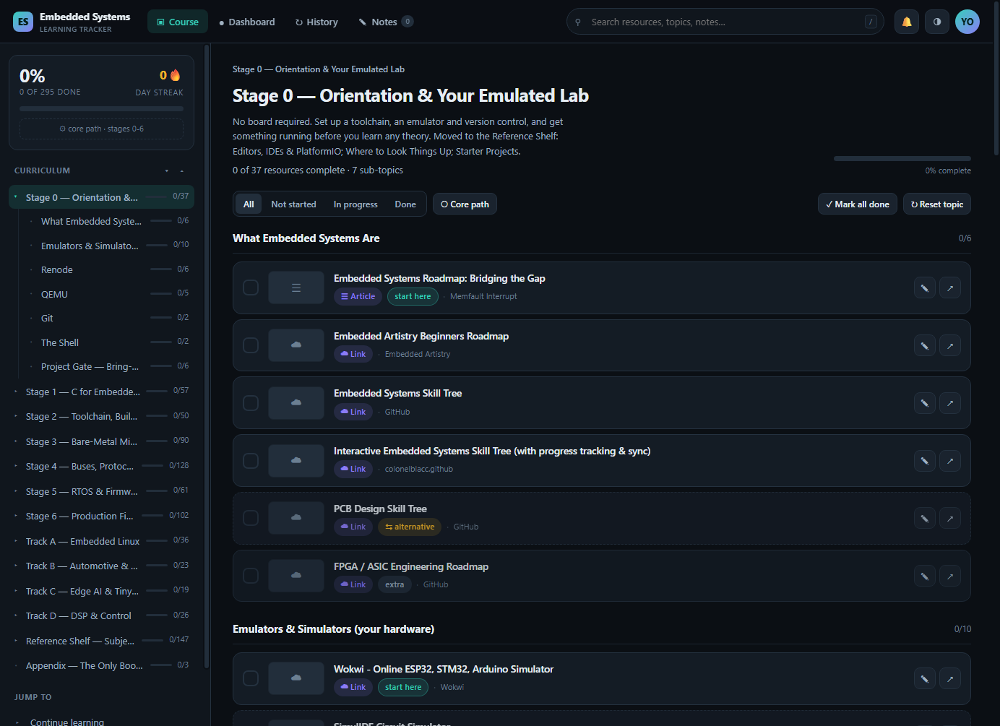
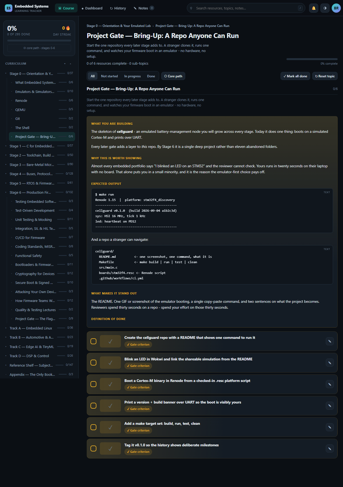

# Embedded Software Engineering — A Free, Emulator-First Syllabus

**[▶ Open the syllabus](https://s-kiruba.github.io/embedded-syllabus/)**

A staged course for becoming an embedded **software** engineer, with a progress tracker built in.
Every resource is free. Nothing needs a development board — the hands-on work runs in **Renode**,
**QEMU** and **Wokwi**, so you can start today and buy hardware later if you ever want to.



## What it is

**13 chapters, 779 resources, 11 project gates with 79 acceptance criteria.**

The curriculum is assembled from two curated lists, then filtered and re-sequenced for embedded
*software* specifically: hardware-engineering topics (PCB, EMC, soldering, FPGA) are removed, all
paid resources are dropped except three optional books, and every link is checked.

| | |
|---|---|
| Stage 0 | Orientation & your emulated lab — Renode, QEMU, Wokwi, git, toolchain |
| Stage 1 | C for embedded systems — memory model, keywords, bit manipulation |
| Stage 2 | Toolchain, build system & debugging — GCC, linker scripts, CMake, GDB |
| Stage 3 | Bare-metal microcontroller programming — registers to DMA |
| Stage 4 | Buses, protocols & connectivity — UART, SPI, I²C, CAN, USB, BLE |
| Stage 5 | RTOS & firmware architecture — FreeRTOS, Zephyr, state machines |
| Stage 6 | Production firmware engineering — TDD, CI, bootloaders, secure boot |
| Tracks A–D | Embedded Linux · Automotive & AUTOSAR · Edge AI & TinyML · DSP & Control |

**The course is the ~295 core items in Stages 0–6.** Everything else is optional, and the app
labels it as such.

### One path per topic, not five

A topic that offers five complete C courses is a month of duplicated work, not a choice. The
builder enforces **one entry point and one comprehensive resource per topic**; substitutes are
marked `[alt]` — *same lesson, different teacher, pick one*. Optional depth is `[extra]`. The
**Core path** button hides both.

### The project gates build one product

The 11 gates are not eleven throwaway exercises. Each stage adds a layer to **the same
repository** — an emulated battery-management node — from repo skeleton through bare-metal drivers,
a CAN stack and an RTOS, to CI that boots the firmware in an emulator on every push and a signed
A/B bootloader.

Because it is emulator-only, a reviewer can clone it and watch it run in twenty seconds with no
hardware. Every gate states what you are building, why it is worth showing, the **expected output**
with concrete examples, and a definition of done you tick off.



## Using it

**Hosted** — [s-kiruba.github.io/embedded-syllabus](https://s-kiruba.github.io/embedded-syllabus/).
No account, nothing to install. Progress, notes and history are stored in your own browser
(IndexedDB) and never leave your machine. Use **Export** to back them up.

**Locally**, with accounts, cross-device sync and email/WhatsApp/desktop reminders:

```
git clone https://github.com/S-Kiruba/embedded-syllabus.git
cd embedded-syllabus
node server.js          # then open http://127.0.0.1:5178
```

Node 22.5+ and **no npm install** — the server uses only Node built-ins (`node:http`,
`node:sqlite`, `node:crypto`). Full details in [APP.md](APP.md).

## Changing the course

`SYLLABUS.md` is **generated**. Edit [`tools/syllabusMap.js`](tools/syllabusMap.js) — the single
file holding every editorial decision — and rebuild:

```
node tools/buildSyllabus.js    # regenerate SYLLABUS.md
node tools/checkLinks.js       # verify every link still resolves
node tools/buildStatic.js      # rebuild the hosted site into docs/
```

Progress ids are hashes of each resource's URL, so re-ordering or re-wording the syllabus keeps
your ticks.

## Credits & licence

This syllabus is a derivative work. It reorganises, filters and annotates material from:

- **[Embedded Engineering Roadmap](https://github.com/m3y54m/embedded-engineering-roadmap)** by
  Meysam Parvizi — licensed [CC BY-SA 4.0](https://creativecommons.org/licenses/by-sa/4.0/)
- the resource list in [`sources/original-resources.md`](sources/original-resources.md)

**Changes made:** resources re-sequenced into staged modules with project gates; hardware-engineering
topics removed; paid resources removed except three optional books; the two lists merged and
de-duplicated; near-duplicate and substitute resources demoted; dead links stripped; an
emulator-first Stage 0 added.

As required by ShareAlike, **`SYLLABUS.md` and this project are licensed
[CC BY-SA 4.0](https://creativecommons.org/licenses/by-sa/4.0/)**.
